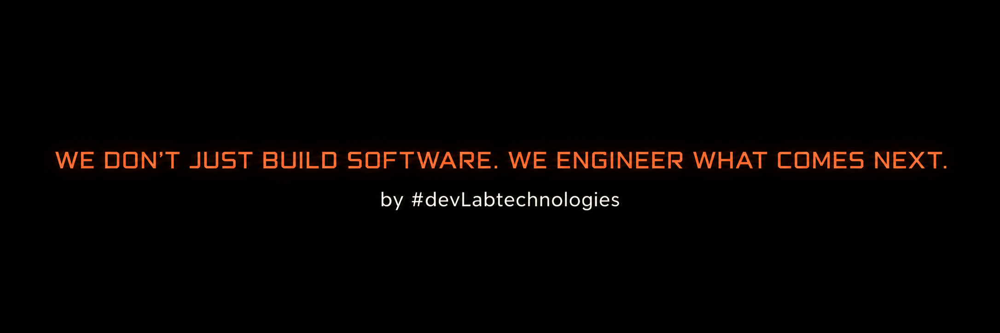

  
  

# Dev Lab Technologies™

### Software Engineering · AI · SaaS · Automation

We build reliable digital products, platforms and intelligent systems for modern businesses.

Building technology beyond borders.
 

 

---

## Sobre Dev Lab Technologies

- Desarrollamos **software y plataformas tecnológicas** orientadas a negocios y operaciones reales.
- Diseñamos sistemas con enfoque en **arquitectura, escalabilidad, seguridad y mantenibilidad**.
- Integramos **frontend, backend, bases de datos, APIs, automatización e inteligencia artificial**.
- Trabajamos con una filosofía de **producto + ingeniería + negocio**.
- Nuestros productos comerciales, propiedad intelectual y líneas de investigación permanecen en **repositorios privados**.

---

## Áreas de ingeniería

| Capacidad | Enfoque |
| --- | --- |
| **Software Architecture** | Sistemas modulares, escalables y mantenibles |
| **Full Stack Engineering** | Experiencias web, servicios, APIs y lógica de negocio |
| **SaaS Platforms** | Plataformas multiusuario y productos digitales de largo plazo |
| **Artificial Intelligence** | Análisis, asistencia, automatización y soporte a decisiones |
| **Business Automation** | Flujos conectados, reducción de tareas manuales e integraciones |
| **Data & Analytics** | Transformación de datos operativos en información accionable |
| **Cloud & DevOps** | CI/CD, contenedores, despliegue, monitoreo y resiliencia |
| **Design Systems** | Interfaces coherentes, tokens, componentes y experiencia de producto |

---

## Core Stack

---

## Cómo construimos

**Research** → **Product Strategy** → **Architecture** → **Design System** → **Engineering** → **Testing** → **Security** → **Deployment** → **Monitoring** → **Continuous Evolution**

---

## Principios de ingeniería

**Architecture First**  
Diseñamos pensando en evolución, mantenibilidad y crecimiento antes de escalar complejidad.

**Product Thinking**  
La tecnología parte del problema de negocio, del usuario y del contexto operativo.

**Security by Design**  
Autenticación, autorización, aislamiento de datos y resiliencia forman parte del producto desde el inicio.

**Quality Engineering**  
Pruebas, auditorías técnicas, revisión de código y protección contra regresiones son parte del ciclo de desarrollo.

**Continuous Evolution**  
Tratamos el software como un sistema vivo que debe medirse, corregirse, optimizarse y evolucionar.

---

## Private Product Development

Nuestra tecnología comercial, productos propietarios, investigación interna y sistemas estratégicos se desarrollan principalmente en **repositorios privados**.

El contenido público de esta organización está destinado únicamente a recursos técnicos, documentación, herramientas reutilizables, estándares de ingeniería e iniciativas seleccionadas.

---

### Creamos tecnología que transforma negocios.

**Ideas + código = impacto.**

 

**Dev Lab Technologies S.A.S. · Colombia**

